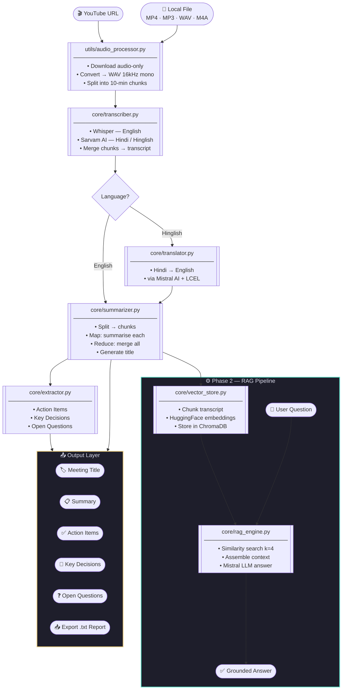
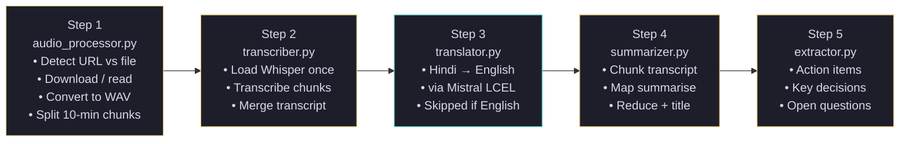
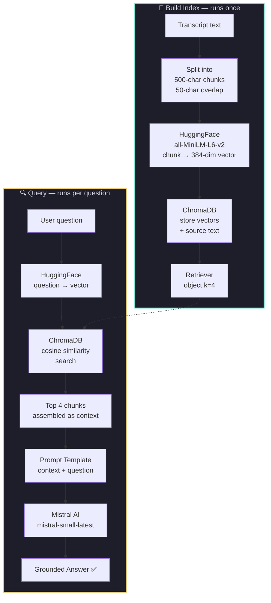

<div align="center">

# ◈ VAIA — Video AI Assistant

### *Transcribe · Summarise · Extract · Chat*

**A fully local, completely free AI-powered meeting intelligence system**

[](https://python.org)
[](https://langchain.com)
[](https://github.com/openai/whisper)
[](https://mistral.ai)
[](https://www.trychroma.com)
[](https://streamlit.io)
[](LICENSE)
[]()

</div>

---

## Table of Contents

1. [The Idea — Where It All Started](#1-the-idea--where-it-all-started)
2. [The Problem Being Solved](#2-the-problem-being-solved)
3. [Deciding the Solution](#3-deciding-the-solution)
4. [Choosing the Right Tools & Technologies](#4-choosing-the-right-tools--technologies)
5. [Designing the Architecture](#5-designing-the-architecture)
6. [System Architecture Diagram](#6-system-architecture-diagram)
7. [Project Structure](#7-project-structure)
8. [Module Deep Dive](#8-module-deep-dive)
9. [Phase 1 — Core Pipeline](#9-phase-1--core-pipeline)
10. [Phase 2 — RAG Engine](#10-phase-2--rag-engine)
11. [The Streamlit UI](#11-the-streamlit-ui)
12. [Installation & Setup](#12-installation--setup)
13. [Configuration](#13-configuration)
14. [Running the Project](#14-running-the-project)
15. [Feature Walkthrough](#15-feature-walkthrough)
16. [Tech Stack Summary](#16-tech-stack-summary)
17. [Challenges & How I Solved Them](#17-challenges--how-i-solved-them)
18. [Project Stats](#18-project-stats)
19. [Future Roadmap](#19-future-roadmap)

---

## 1. The Idea — Where It All Started

The inspiration for VAIA came from two tools I noticed doing something really interesting:

**YouTube's AI "Ask" button** — YouTube quietly rolled out a feature that lets you ask questions about a video you're watching. It summarises content and answers queries grounded in the video. I found this genuinely useful but limited — it only works on YouTube, you can't export anything, and you have no control over the data.

**Fireflies.ai** — A meeting intelligence tool that joins your calls, transcribes them, and gives you summaries and action items. Brilliant concept. But it charges $20–$40/month per user, the data lives on their servers, and it only works for live calls — not recorded videos or local files.

The question I asked myself was simple:

> *"Why can't I build a single, free tool that does both — accepts any video or audio input, transcribes it locally, summarises it with AI, extracts insights, and lets me chat with the content?"*

That question became VAIA.

---

## 2. The Problem Being Solved

Every professional sits through hours of meetings every week. But most of the value gets lost the moment the call ends.

| Problem | Reality |
|---------|---------|
| **No notes taken** | People forget 90% of what was discussed within an hour |
| **Expensive tools** | Otter.ai, Fireflies charge $20–$40/month for basic transcription |
| **Action items lost** | Tasks assigned during meetings go untracked with no clear owner |
| **No way to search back** | Impossible to find what was said 3 weeks ago without rewatching |
| **Privacy concerns** | Cloud-based tools store your confidential meeting data on their servers |
| **No offline support** | Existing tools require internet and live integration, not local files |

VAIA solves all six. It runs entirely on your machine, costs nothing, and works on any audio or video source.

---

## 3. Deciding the Solution

Before writing a single line of code, I mapped out what the ideal tool would do:

**Must-have features:**
- Accept any input — YouTube URL, MP4, MP3, WAV, M4A
- Transcribe locally so there's no per-minute API cost
- Summarise the transcript intelligently — not just extract text
- Pull out structured insights: action items, decisions, open questions
- Allow you to ask natural language questions about the meeting
- Export the full report so you can share or archive it

**Constraints I set:**
- **Zero cost** — no paid APIs for core functionality
- **Local-first** — transcription and embeddings must run on-device
- **No internet dependency** for the core pipeline (only LLM calls hit an API)
- **Multilingual** — must support Hindi and Hinglish, not just English
- **Modular** — each component must be swappable independently

With these constraints clear, the architecture essentially designed itself.

---

## 4. Choosing the Right Tools & Technologies

Every technology decision had a specific reason behind it. Here's the thinking:

### Speech-to-Text: OpenAI Whisper (local) + Sarvam AI (Hindi)

I evaluated three options:
- **Google Speech-to-Text API** — Accurate but costs money per minute. Eliminated.
- **AssemblyAI** — Great but cloud-only, not local. Eliminated.
- **OpenAI Whisper** — Open source, runs locally, supports 99 languages, free forever. Chosen.

For Hindi specifically, Whisper's accuracy drops noticeably on conversational Hinglish. So I added **Sarvam AI** as a fallback — it's a free-tier Indian AI API built specifically for Indian languages with a `saaras:v2.5` model.

### LLM: Mistral AI

I needed an LLM for summarisation, extraction, and RAG. Options evaluated:
- **OpenAI GPT-4** — Excellent but expensive. Eliminated.
- **Ollama (local LLaMA)** — Fully local but requires 8–16GB VRAM. Too heavy for most users.
- **Mistral AI (free tier)** — `mistral-small-latest` is available free, has a generous rate limit, and performs excellently on structured extraction tasks. Chosen.

### Vector Database: ChromaDB

For RAG, I needed to store and retrieve transcript embeddings. Options:
- **Pinecone** — Cloud-hosted, has free tier but limited. Eliminated (cloud dependency).
- **FAISS** — Facebook's library, fast but no persistence out of the box.
- **ChromaDB** — Local, persistent, integrates natively with LangChain, zero configuration needed. Chosen.

### Embeddings: HuggingFace all-MiniLM-L6-v2

This model converts text chunks to vectors for semantic search. It runs entirely locally on CPU, is only 80MB, and performs well enough for retrieval tasks. No API call needed.

### Framework: LangChain LCEL

LangChain's **LCEL (Expression Language)** allows writing AI pipelines as composable chains using the `|` operator — clean, readable, and testable. I deliberately avoided legacy LangChain chains (`LLMChain`, `SequentialChain`) and used pure LCEL Runnable syntax throughout.

### Audio Processing: yt-dlp + pydub + ffmpeg

- `yt-dlp` downloads audio-only streams from YouTube (much faster than full video)
- `pydub` handles audio manipulation — conversion, resampling, splitting
- `ffmpeg` is the underlying engine for format conversion to WAV at 16kHz mono (what Whisper expects)

### UI: Streamlit

Streamlit lets you build full browser UIs in pure Python with no JavaScript. For a data science project, it's the fastest path from working pipeline to shareable interface. The custom CSS layer transforms the default Streamlit appearance into a fully custom dark editorial design.

---

## 5. Designing the Architecture

With tools chosen, I designed the architecture in two phases:

**Phase 1 — Linear Pipeline (process once, output everything)**

The first pass through a video is sequential and expensive (Whisper is slow). So Phase 1 runs once and produces all static outputs:

```
Input → Audio Processing → Transcription → Translation → Summarisation → Extraction
```

Each step feeds into the next. Results are stored in a Python dictionary and persisted in session state.

**Phase 2 — RAG Pipeline (interactive, on demand)**

Once the transcript exists, Phase 2 indexes it for semantic search and enables the chat interface:

```
Transcript → Chunk → Embed → ChromaDB → Retriever → LLM → Answer
```

This runs once (building the index) and then handles unlimited queries at near-instant speed.

**Key architectural decision:** I kept Phase 1 and Phase 2 completely decoupled. The RAG engine doesn't need to re-run if you ask more questions — ChromaDB persists the index to disk. On subsequent runs with the same content, it loads from disk instead of re-embedding.

---

## 6. System Architecture Diagram



---

## 7. Project Structure

```
vaia/
│
├── core/                          # All AI processing logic
│   ├── __init__.py
│   ├── transcriber.py             # Whisper + Sarvam speech-to-text
│   ├── translator.py              # Hindi → English via Mistral
│   ├── summarizer.py              # Map-reduce summarisation + title
│   ├── extractor.py               # Action items, decisions, questions
│   ├── vector_store.py            # ChromaDB setup + HuggingFace embeddings
│   └── rag_engine.py              # LCEL RAG chain + Q&A interface
│
├── utils/                         # Helper utilities
│   ├── audio_processor.py         # YouTube download, format conversion, chunking
│   └── file_handler.py            # File type detection and path handling
│
├── downloads/                     # Downloaded audio files (git-ignored)
├── vector_db/                     # ChromaDB persistent store (git-ignored)
├── .venv/                         # Python virtual environment (git-ignored)
│
├── main.py                        # CLI entry point — full pipeline + chat loop
├── app.py                         # Streamlit web UI
├── requirements.txt               # All 44 dependencies
├── .env                           # API keys (git-ignored)
├── .gitignore
└── README.md
```

---

## 8. Module Deep Dive

### `utils/audio_processor.py`
The gateway for all input. Detects whether input is a YouTube URL or a local file path, routes accordingly, converts everything to mono 16kHz WAV (the exact format Whisper expects), and splits files into 10-minute chunks to prevent memory overload during transcription.

**Key functions:**

| Function | Purpose |
|----------|---------|
| `process_input(source)` | Auto-detects URL vs local file, orchestrates the full prep |
| `download_youtube_audio(url)` | Downloads audio-only stream via yt-dlp, saves as WAV |
| `convert_to_wav(path)` | Converts MP4/MP3/M4A to 16kHz mono WAV via ffmpeg |
| `chunk_audio(path)` | Splits large WAV into 10-min pieces, returns list of paths |

---

### `core/transcriber.py`
Runs speech-to-text on every audio chunk. Supports two backends — Whisper for English and Sarvam for Hindi. The Whisper model is loaded once into memory and reused across all chunks (lazy loading). For Sarvam, chunks are further split into 25-second pieces due to the API's 30-second limit.

**Key functions:**

| Function | Purpose |
|----------|---------|
| `load_model()` | Lazy-loads Whisper (configurable: tiny/small/medium/large) |
| `transcribe_chunk_whisper(path)` | Local Whisper transcription for English |
| `transcribe_chunk_sarvam(path)` | Sarvam API transcription for Hindi/Hinglish |
| `transcribe_all(chunks, language)` | Orchestrates all chunks, returns merged transcript |

---

### `core/translator.py`
Takes Hindi or Hinglish transcript text and uses Mistral via a LangChain LCEL chain to produce clean professional English. Preserves technical terms, names, and numbers. Only invoked when language is `hinglish`.

---

### `core/summarizer.py`
Uses a **map-reduce approach** because transcripts can be too long to fit in a single LLM context window:

1. **Split** — Transcript is broken into 3000-character chunks with 200-character overlap
2. **Map** — Each chunk is summarised independently by Mistral
3. **Reduce** — All chunk summaries are combined and re-summarised into one final output
4. **Title** — A separate chain generates a professional meeting title (≤8 words)

Temperature is set to `0.3` for consistent, factual summaries.

---

### `core/extractor.py`
Defines a reusable `build_chain()` function that creates LangChain LCEL chains with custom prompts. Three chains run on the full transcript:

| Chain | Extracts | Format |
|-------|----------|--------|
| Action Items | Tasks with owner + deadline | Numbered list |
| Key Decisions | Decisions made in the meeting | Numbered list |
| Open Questions | Unresolved topics needing follow-up | Bulleted list |

Temperature is `0.2` for more deterministic, structured extraction.

---

### `core/vector_store.py`
Sets up and manages the ChromaDB vector database:

- Chunks transcript into 500-character pieces with 50-character overlap (smaller than summariser chunks for finer retrieval)
- Generates embeddings using `all-MiniLM-L6-v2` running locally on CPU
- Persists to `vector_db/` directory — subsequent runs load from disk instead of re-embedding
- Returns a retriever configured for similarity search with `k=4` results

---

### `core/rag_engine.py`
Builds the full RAG pipeline using LangChain LCEL:

```
User Question
     │
     ▼
Vector Retriever (ChromaDB, k=4)
     │
     ▼
Context Assembly (4 most relevant chunks)
     │
     ▼
Prompt Template (question + context)
     │
     ▼
Mistral LLM (mistral-small-latest)
     │
     ▼
Grounded Answer
```

No legacy chains used — pure LCEL `RunnablePassthrough` and `|` syntax throughout.

---

## 9. Phase 1 — Core Pipeline



---

## 10. Phase 2 — RAG Engine

RAG (Retrieval-Augmented Generation) is what makes the chat interface actually useful. Without RAG, the LLM has no knowledge of your specific meeting — it would either hallucinate or say "I don't have that information."

**Without RAG:**
```
User: "What did Rahul say about the Q3 budget?"
LLM:  "I don't have information about your meeting." ❌
```

**With RAG:**
```
User: "What did Rahul say about the Q3 budget?"
ChromaDB: [finds 4 most relevant transcript chunks about budget discussion]
LLM:  "Rahul mentioned the Q3 budget needs to be revised downward by 15%,
       and he will share the updated figures by Friday." ✅
```

**How it works step by step:**



---

## 11. The Streamlit UI

The UI (`app.py`) is built with Streamlit and a fully custom CSS layer that transforms the default appearance into a dark editorial design called **VAIA**.

**Design system:**

| Token | Value | Usage |
|-------|-------|-------|
| `--ink` | `#0d0d12` | Page background |
| `--ink-2` | `#16161f` | Cards, sidebar |
| `--gold` | `#e8c97a` | Primary accent, buttons |
| `--teal` | `#5de0c8` | Secondary accent, action items |
| `--rose` | `#f07090` | Tertiary accent, questions |
| `DM Serif Display` | Serif | Headings, titles |
| `DM Mono` | Monospace | Labels, tags, code |
| `Outfit` | Sans-serif | Body text, UI elements |

**UI sections:**

```
Sidebar
├── VAIA wordmark
├── YouTube URL / File path input
├── Language selector (english / hinglish)
├── Run Analysis button
├── New Session button (after run)
├── Live pipeline status (6 steps with animated indicators)
└── Model info footer

Main Area
├── Hero section (heading + capability pills)
├── [After analysis]
│   ├── Session title banner
│   ├── Export Report button (.txt download)
│   ├── Summary card (with word count + compression %)
│   ├── Full transcript expander (word count + read time)
│   ├── Intelligence row: Action Items | Decisions | Questions
│   └── RAG Chat interface
│       ├── Chat history (auto-scroll to latest)
│       ├── Message input + Send button
│       └── Clear conversation button
└── [Before analysis] Empty state
```

---

## 12. Installation & Setup

### Prerequisites

- Python 3.10 or higher
- `ffmpeg` installed and on PATH
- 8GB RAM minimum (for Whisper small model)
- Git

### Step 1 — Clone the repository

```bash
git clone https://github.com/Saket22-CS/vaia-video-ai-assistant.git
cd vaia
```

### Step 2 — Create virtual environment

```bash
# Windows
python -m venv .venv
.venv\Scripts\activate

# macOS / Linux
python -m venv .venv
source .venv/bin/activate
```

### Step 3 — Install dependencies

```bash
pip install -r requirements.txt
```

> First run will also download the Whisper model (~460MB for `small`) and the HuggingFace embedding model (~80MB). This happens automatically.

### Step 4 — Install ffmpeg

```bash
# Windows (via chocolatey)
choco install ffmpeg

# macOS
brew install ffmpeg

# Ubuntu / Debian
sudo apt install ffmpeg
```

---

## 13. Configuration

Create a `.env` file in the project root:

```env
# Required: Mistral AI (free at console.mistral.ai)
MISTRAL_API_KEY=your_mistral_api_key_here

# Optional: Sarvam AI for Hindi transcription (free at sarvam.ai)
SARVAM_API_KEY=your_sarvam_api_key_here

# Whisper model size: tiny | base | small | medium | large
# small = best balance of speed and accuracy (recommended)
WHISPER_MODEL=small

# Sarvam model version
SARVAM_STT_MODEL=saaras:v2.5
```

**Getting API keys:**

| Service | URL | Cost |
|---------|-----|------|
| Mistral AI | [console.mistral.ai](https://console.mistral.ai) | Free tier, no credit card |
| Sarvam AI | [sarvam.ai](https://sarvam.ai) | Free tier for Hindi STT |

---

## 14. Running the Project

### Option A — Streamlit Web UI (recommended)

```bash
streamlit run app.py
```

Opens at `http://localhost:8501` in your browser.

### Option B — CLI Mode

```bash
python main.py
```

Prompts for input source and language, then runs the full pipeline with interactive chat in the terminal.

### Example inputs

```bash
# YouTube video
https://www.youtube.com/watch?v=dQw4w9WgXcQ

# Local files
/path/to/meeting_recording.mp4
/path/to/audio.mp3
C:\Users\name\Downloads\standup.wav
```

---

## 15. Feature Walkthrough

### Transcription
Paste any YouTube URL or local file path. VAIA downloads the audio (YouTube-only), converts it to WAV, and runs Whisper locally. No audio ever leaves your machine during transcription.

### Smart Summarisation
The map-reduce approach means even 2-hour recordings get summarised correctly — the transcript is chunked, each chunk summarised, then all summaries merged into one coherent output. A meeting title is auto-generated.

### Intelligence Extraction
Three structured outputs are extracted:
- **Action Items** — *"Priya to share revised deck by Thursday"*
- **Key Decisions** — *"Team agreed to delay launch to Q4"*
- **Open Questions** — *"Still unresolved: which vendor to choose for cloud infra"*

### RAG Chat
Ask anything about the meeting in natural language. VAIA retrieves the most relevant parts of the transcript and answers with full context — no hallucination, no guessing.

```
You:   "What was decided about the marketing budget?"
VAIA:  "The team decided to increase the marketing budget by 20% for Q3,
        with focus on digital channels. Arun was assigned to allocate
        the budget breakdown before the next sync."
```

### Export Report
Download a structured `.txt` report containing the title, summary, action items, decisions, open questions, and full transcript — formatted and ready to share or archive.

---

## 16. Tech Stack Summary

| Layer | Technology | Version | Purpose |
|-------|-----------|---------|---------|
| **Language** | Python | 3.10+ | Core language |
| **Audio Download** | yt-dlp | latest | YouTube audio extraction |
| **Audio Processing** | pydub + ffmpeg | — | Format conversion, chunking |
| **Transcription (EN)** | OpenAI Whisper | 2.2.0 | Local speech-to-text |
| **Transcription (HI)** | Sarvam AI | saaras:v2.5 | Hindi/Hinglish STT API |
| **LLM** | Mistral AI | mistral-small-latest | Summarisation, extraction, RAG |
| **AI Framework** | LangChain LCEL | 0.2+ | Pipeline chaining |
| **Embeddings** | HuggingFace | all-MiniLM-L6-v2 | Local text vectorisation |
| **Vector DB** | ChromaDB | 0.5.0 | Semantic search + RAG retrieval |
| **Deep Learning** | PyTorch | — | Whisper backend |
| **UI** | Streamlit | — | Web interface |
| **Config** | python-dotenv | — | Environment variable management |

---

## 17. Challenges & How I Solved Them

### Challenge 1 — Long Audio Files Crash Whisper
**Problem:** Whisper loads the entire audio file into memory. Files longer than 30 minutes cause OOM errors on 8GB RAM systems.

**Solution:** Split audio into 10-minute chunks before transcription. Each chunk processes independently and the transcripts are concatenated afterward with a newline separator.

---

### Challenge 2 — Transcript Too Long for LLM Context
**Problem:** A 2-hour meeting transcript can be 30,000+ tokens — well beyond Mistral's context window for a single summarisation call.

**Solution:** Map-reduce summarisation. Each 3000-character chunk (with 200-char overlap for continuity) is summarised independently, then all summaries are combined into a final pass. This scales to any transcript length.

---

### Challenge 3 — Sarvam API's 30-Second Limit
**Problem:** Sarvam's free tier only accepts audio chunks up to 30 seconds. The audio processor produces 10-minute chunks — way too long.

**Solution:** For Hinglish mode, audio chunks are further split into 25-second micro-chunks before sending to Sarvam, then all micro-transcripts are merged back. The Whisper path is unaffected.

---

### Challenge 4 — RAG Answers Without Context Feel Fabricated
**Problem:** Early versions of the RAG prompt didn't enforce groundedness. Mistral would sometimes answer from general knowledge when the transcript didn't contain the answer.

**Solution:** Explicit prompt instruction: *"Answer ONLY based on the provided context. If the context does not contain enough information to answer the question, say so."* Temperature set to `0.1` for RAG queries (much lower than summarisation) to reduce creative generation.

---

### Challenge 5 — ChromaDB Re-embeds on Every Run
**Problem:** Embedding a long transcript takes 20–40 seconds with the local model. Running this on every app rerun was unacceptably slow.

**Solution:** ChromaDB's `persist_directory` parameter saves the vector store to `vector_db/` on disk. `load_vector_store()` checks if a collection already exists before re-building. Only new transcripts trigger re-embedding.

---

### Challenge 6 — Streamlit Reruns Clear State
**Problem:** Streamlit reruns the entire script top-to-bottom on every interaction. Without careful state management, the RAG chain, transcript, and chat history disappear on every button click.

**Solution:** All expensive objects are stored in `st.session_state` after the pipeline runs. The pipeline checks `if st.session_state.result` before re-running. The `rag_chain` object itself is stored in session state so it persists across chat turns without re-building.

---

## 18. Project Stats

| Metric | Value |
|--------|-------|
| Total Python files | 8 |
| Lines of code | ~570 (core) + ~450 (UI) |
| Core modules | 6 |
| API services | 2 (Mistral, Sarvam) |
| Local models | 2 (Whisper, all-MiniLM-L6-v2) |
| Dependencies | 44 packages |
| Vector DB | ChromaDB (local, persistent) |
| Supported languages | English, Hindi, Hinglish |
| Supported input formats | YouTube URL, MP4, MP3, WAV, M4A |
| Average processing time | ~3–5 min for a 1-hour meeting (CPU) |
| Monthly cost | $0 |

---

## 19. Future Roadmap

| Feature | Description | Priority |
|---------|-------------|----------|
| **Speaker Diarisation** | Identify and label who said what using pyannote.audio | High |
| **PDF Export** | Generate formatted meeting reports as PDF via fpdf2 | High |
| **Multi-language Output** | Summarise in original language, not just English | Medium |
| **Streamlit Cloud Deploy** | One-click deploy to Streamlit Community Cloud | Medium |
| **Real-time Processing** | Stream transcription as video plays (word by word) | Medium |
| **Batch Processing** | Queue multiple videos/meetings for overnight processing | Low |
| **Slack/Email Integration** | Auto-send summary to Slack channel or email after processing | Low |
| **Meeting Comparison** | Compare two meetings — find recurring action items or unresolved topics | Low |
| **Custom Prompts UI** | Let users customise the extraction prompts from the UI | Low |

---

<div align="center">

**Built with 100% free, open-source tools.**

*Whisper · Mistral · LangChain · ChromaDB · Streamlit*

---

If this project helped you, consider starring the repo ⭐

</div>